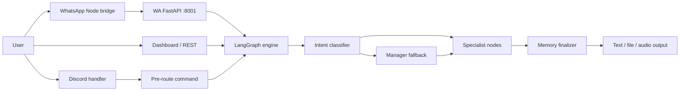

# Arsitektur BIMA_CORE

Dokumen ini menjelaskan kondisi runtime yang terlihat dari kode dan konfigurasi repository. `main.py`, `core/`, `config.py`, dan `ecosystem.config.js` tetap menjadi sumber kebenaran utama.

## Gambaran Sistem

BIMA_CORE menerima input dari Discord, WhatsApp, atau dashboard. Handler channel melakukan validasi dan pre-route command langsung. Permintaan AI diteruskan ke LangGraph, diklasifikasikan melalui fast path, lalu diproses manager atau satu/lebih node spesialis. Hasil akhir dikirim kembali ke channel asal dan dapat menyertakan file di `outputs/`.



## Proses Runtime

| PM2 process | Entry | Tanggung jawab |
|---|---|---|
| `anisa-v3` | `main.py` | Discord, WA FastAPI thread, dashboard FastAPI thread, MCP, plugin, dan LangGraph |
| `bima-whatsapp` | `whatsapp/index.js` | Session WhatsApp Web dan forwarding HTTP ke WA FastAPI |
| `bima-tunnel` | `cloudflared` | Mengekspos dashboard lokal melalui tunnel |
| `anisa-status` | `scripts/status_collector.py` | Menulis snapshot status operasional |
| `agentmemory` | `services/agentmemory/` | Semantic memory opsional ketika feature flag aktif |

`main.py` mengikat WA bridge ke `127.0.0.1:8001` dan dashboard ke `127.0.0.1:8000` secara default. Keduanya berjalan di thread/event loop berbeda dari Discord.

## Orkestrasi LangGraph

`core/langgraph_engine.py` membangun `StateGraph(BimaState)` dengan alur utama:

```text
context summarizer (conditional)
  → intent classifier
  → manager fallback atau specialist fast-path
  → specialist lanjutan bila diminta
  → memory finalizer
  → END
```

Chat ringan yang eksplisit seperti `tes`, `ping`, salam, dan acknowledgement aman melewati context summarizer serta semantic memory. Manager memakai prompt ringkas dengan model Flash yang sama agar latensi turun tanpa mengurangi model untuk tugas biasa atau berat.

Sepuluh CrewAI agent canonical terdaftar di `core/agent_registry.py`: manager, intel, mekanik, arsip, visual, seniman, admin, lifestyle, saham, dan kodok. Graph juga memiliki node observer dan canvas yang tidak berada pada registry injeksi MCP tersebut.

`core/model_router.py` menjadi sumber tunggal pemetaan model. Manager dan tugas ringan memakai DeepSeek V4 Flash 0731; coding, saham, dan reasoning berat memakai DeepSeek V4 Pro 0813; visual, browser, observer, canvas, serta Seniman memakai Gemini 3.7 Flash; Intel dan sintesis Arsip berat memakai Qwen3.8 27B; Admin berat dan Threads memakai Claude Sonnet 5; Strix security scanner memakai GPT-5.6 Luna Pro. Selector lokal memilih profil dari isi request tanpa panggilan LLM tambahan. Node yang punya profil ringan/berat menyalin agent canonical per request agar request paralel tidak saling mengganti model.

Setiap profil menyimpan fallback OpenRouter dan `reasoning_effort` bila diperlukan. `ENABLE_MODEL_ROUTER=0` mematikan pemilihan profil dinamis dan mengembalikan profil standar tiap tim tanpa mengubah kode caller.

Urutan delegasi multi-agent yang didukung manager adalah Intel → Arsip → Seniman → Admin. Node lain biasanya menyelesaikan request lalu menuju memory finalizer.

## Kontrak State

`core/langgraph_nodes/state.py` mendefinisikan `BimaState`:

| Field | Fungsi |
|---|---|
| `messages` | Riwayat message LangChain; digabung dengan reducer `operator.add` |
| `user_request` | Prompt user saat ini |
| `attachment_paths` | File input yang sudah disimpan handler |
| `realtime_context` | Konteks waktu/request |
| `current_plan` | Rencana kerja manager bila digunakan |
| `active_teams` | Urutan specialist yang dipilih |
| `temp_data` | Data antar-node |
| `is_finished` | Menandai response siap selesai |
| `discord_user_id` | Identitas untuk session/checkpoint |
| `source_channel` | `discord`, `whatsapp`, atau unknown |
| `gen_mode` | Mode image/video bila dipilih classifier |
| `conversation_summary` | Ringkasan percakapan panjang |

Progress callback tidak disimpan di checkpoint. Callback berada di registry proses berdasarkan thread ID karena function tidak dapat diserialisasi oleh MsgPack.

## Komponen Utama

| Komponen | Lokasi | Input → Output | Dependency / boundary |
|---|---|---|---|
| Bootstrap | `main.py` | Process start → seluruh runtime | Gagalnya sidecar non-kritis memakai fallback; audit MCP kritis dapat menghentikan startup |
| Discord | `core/discord_bot.py` | Discord events → command atau LangGraph | Token dari environment; attachment dan reply mengikuti batas Discord |
| WhatsApp API | `core/wa_server.py` | HTTP `/chat` → LangGraph response | Token bridge opsional; busy lock mencegah request paralel berlebih |
| Dashboard | `core/dashboard_server.py` | HTTP/WebSocket → status, command, chat | Endpoint sensitif dilindungi dashboard token |
| Orchestrator | `core/langgraph_engine.py` | `BimaState` → final state | Checkpoint SQLite dibuat per event loop |
| Specialist nodes | `core/langgraph_nodes/` | State → state update | Boundary ke CrewAI agent di `teams/` |
| CrewAI agents | `teams/` | Task specialist → text/artefak | Tool hanya yang didaftarkan pada agent terkait |
| Shared tools | `tools/`, `teams/t5_intel.py` | Input terstruktur → hasil tool | Path, network, credential, tanggal, dan relevansi hasil web divalidasi di trust boundary |
| WhatsApp bridge | `whatsapp/` | WA events ↔ HTTP local bridge | Node.js process terpisah dan session lokal |

## Penyimpanan dan External Service

- LangGraph checkpoint: `memory/checkpoints.db` (SQLite).
- Agent memory fallback: SQLite; sidecar AgentMemory bersifat opsional.
- Semantic index: LanceDB di `vault_index/` dan `repo_index/`. Arsip production memakai embedding Qwen3 8B melalui OpenRouter dalam batch; hybrid BM25 tetap lokal dan reranker CrossEncoder lokal dinonaktifkan untuk menjaga RAM.
- Artefak: `outputs/`; log runtime: `logs/`; snapshot status: `runtime/`.
- LLM utama melalui OpenRouter; credential dibaca dari environment.
- Pencarian umum memakai Serper Web. Query berita memakai Serper News berlokasi Indonesia, filter publikasi 24 jam, deduplikasi preview event yang sudah selesai, serta cross-check Tavily News satu hari. Cache berita terpisah dengan TTL lima menit.
- Discord dan WhatsApp menjadi channel eksternal; Cloudflare Tunnel mengekspos dashboard bila process aktif.
- MCP server diatur melalui `config_mcp.json` dan disaring `core/mcp_security.py` sebelum injeksi.

## Fresh Context dan Approval Threads

- Draf post/reply Threads hanya menerima topik, komentar, dan konteks request aktif. Raw `VIRAL_PATTERN`, konteks draf global, serta revisi milik request lama tidak masuk prompt baru.
- Pencarian Threads memakai Serper News dengan filter maksimal 24 jam. Hasil tanpa tanggal, label berbasis hari, dan label relatif yang sudah mencapai 24 jam dibuang. Cache daftar tren berumur lima menit dan hanya dapat dikonsumsi sekali.
- Scheduler selalu meminta topik baru ke LLM lalu mencari konteks live untuk topik itu. Judul di `scientific_facts.json` dan recent topics hanya menjadi denylist; konteks lama tidak dibaca, dan job dilewati jika konteks live tidak tersedia.
- Approval menyimpan draf publish per `req_id`, terpisah dari wrapper tampilan Discord. Revisi hanya berlaku untuk `THREADS_POST`/`THREADS_REPLY`; approve ditahan selama revisi diproses, preview lama ditolak, dan seluruh state/timer dibersihkan pada approve, reject, gagal kirim, atau timeout.
- Timeout tanpa revisi masih dapat melewati pemeriksaan auto-post `SAFE` yang exact. Timeout dengan revisi aktif atau belum disetujui selalu fail-closed dan tidak boleh mempublikasikan draf awal.

## Error Handling

- `make_resilient()` memberi timeout dan retry terbatas pada node LangGraph, lalu mengembalikan pesan gagal yang aman.
- Startup service opsional biasanya log warning dan melanjutkan dengan fallback.
- Detail internal disimpan di log; response channel tidak boleh membocorkan credential atau trace.
- WhatsApp bridge memperlakukan lookup metadata chat dan indikator typing sebagai best-effort; kegagalan keduanya tidak boleh menggagalkan forwarding `/chat`.
- Solusi error berulang dicatat di [ERROR_SOLUTIONS.md](ERROR_SOLUTIONS.md).

## Batasan Perubahan

Perbarui dokumen ini bila ada perubahan pada node/edge graph, field `BimaState`, port/service PM2, storage, auth boundary, external service, atau alur channel. Perubahan detail implementasi internal yang tidak mengubah kontrak tidak perlu memperpanjang dokumen ini.
