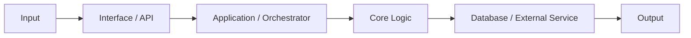

# Prompt Audit dan Dokumentasi Repository

Salin prompt di bawah ke coding agent yang memiliki akses ke repository target.

---

Audit repository ini lalu buat atau rapikan sistem dokumentasi Markdown yang minimal, matang, dan dapat dipakai oleh coding agent lintas platform.

## Tujuan

Gunakan struktur utama berikut:

```text
AGENTS.md
README.md
docs/
├── ARCHITECTURE.md
├── ERROR_SOLUTIONS.md
└── WORKLOG.md
```

Fungsi setiap file:

- `AGENTS.md` — satu-satunya sumber aturan coding agent.
- `README.md` — panduan manusia untuk memahami dan menjalankan proyek.
- `docs/ARCHITECTURE.md` — arsitektur aktual berdasarkan kode.
- `docs/ERROR_SOLUTIONS.md` — knowledge base masalah dan solusi terverifikasi.
- `docs/WORKLOG.md` — status pekerjaan aktif dan handoff.

Jangan membuat banyak file dengan fungsi sama.

Contoh file rules duplikat:

- `CLAUDE.md`
- `.clauderules`
- `CODEX.md`
- `CURSOR.md`
- `COPILOT.md`
- `WINDSURF.md`
- `RULES.md`
- `AI_INSTRUCTIONS.md`

Contoh file status duplikat:

- `HANDOFF.md`
- `PROGRESS.md`
- `DEV_LOG.md`
- `TASK_LOG.md`
- `CURRENT_STATUS.md`
- `NOTES.md`

Jika tool membutuhkan filename khusus seperti `CLAUDE.md`, pertahankan hanya sebagai redirect singkat:

```md
# Agent Instructions

Aturan utama berada di [AGENTS.md](AGENTS.md).

Baca file tersebut sebelum mengubah repository.
```

---

## Prinsip Utama

1. Kode dan konfigurasi aktual adalah sumber kebenaran utama.
2. Jangan mengarang arsitektur, fitur, dependency, command, service, port, schema, atau workflow.
3. Jangan membaca atau menyalin credential, `.env`, token, password, atau secret.
4. Jangan menduplikasi penjelasan panjang di beberapa file.
5. Gunakan relative link antarfile.
6. Pisahkan informasi agent, manusia, arsitektur, error, dan status pekerjaan.
7. Bedakan dengan jelas:
   - Sudah diimplementasikan.
   - Opsional atau feature-flagged.
   - Masih direncanakan.
   - Belum dapat diverifikasi.
8. Pertahankan perubahan user yang sudah ada.
9. Jangan mengubah source code kecuali diperlukan untuk memperbaiki link atau command dokumentasi.
10. Folder vendor, generated output, dependency, submodule, dan nested repository tidak boleh diperlakukan sebagai source utama proyek.

---

## Workflow Wajib

Ikuti urutan:

```text
EXPLORE → PLAN → CODE → VERIFY
```

### 1. EXPLORE

Sebelum mengubah file:

1. Periksa `git status`, branch aktif, dan diff file dokumentasi.
2. Inventaris seluruh file Markdown.
3. Cari seluruh file aturan agent, handoff, worklog, troubleshooting, dan architecture.
4. Identifikasi nested repository, submodule, vendor, generated folder, dan dependency.
5. Baca manifest dan konfigurasi yang relevan, misalnya:
   - `package.json`
   - `pyproject.toml`
   - `requirements*.txt`
   - `Cargo.toml`
   - `go.mod`
   - `pom.xml`
   - `build.gradle`
   - `Makefile`
   - `Dockerfile`
   - `docker-compose.yml`
   - Workflow CI/CD
   - Konfigurasi process manager
6. Temukan dan verifikasi:
   - Entry point.
   - Bahasa dan runtime.
   - Framework.
   - Service dan worker.
   - API dan channel input.
   - Database dan storage.
   - Queue atau event system.
   - External service.
   - Test suite.
   - Build process.
   - Deployment process.
   - Observability dan error handling.
7. Telusuri minimal satu flow utama dari input sampai output.
8. Tandai dokumentasi lama sebagai akurat, usang, duplikat, bertentangan, atau tidak terverifikasi.
9. Jangan membuka `.env` atau file credential.
10. Gunakan internet hanya jika diperlukan untuk memverifikasi klaim versi atau external service, dan prioritaskan sumber resmi.

### 2. PLAN

Buat satu rencana yang sekaligus menjadi task list.

Rencana wajib menyebutkan:

- File yang dibuat.
- File yang diperbarui.
- File yang digabungkan.
- File yang dijadikan redirect.
- File yang dihapus.
- Informasi yang dipertahankan.
- Duplikasi yang ditemukan.
- Kontradiksi yang ditemukan.
- Sumber bukti setiap klaim.
- Cara verifikasi.

Minta satu kali approval sebelum perubahan. Setelah disetujui, lanjutkan CODE dan VERIFY tanpa approval tambahan kecuali scope berubah atau ditemukan risiko destruktif baru.

### 3. CODE

Saat mengedit dokumentasi:

- Gunakan minimal diff.
- Pertahankan informasi lama yang masih benar.
- Hapus klaim yang tidak dapat dibuktikan.
- Jangan memindahkan status lama ke worklog seolah masih aktif.
- Jangan menyimpan output terminal mentah.
- Jangan membuat file tambahan hanya agar dokumentasi terlihat lengkap.
- Gunakan heading, tabel, diagram, dan relative link secara konsisten.
- Hapus file lama hanya jika penghapusannya sudah tercantum dalam PLAN yang disetujui.

### 4. VERIFY

Setelah perubahan:

1. Periksa seluruh relative link.
2. Pastikan path dan filename benar, termasuk kapitalisasi.
3. Pastikan command benar-benar tersedia.
4. Pastikan entry point, service, port, module, dan process name sesuai repository.
5. Cari referensi ke file lama yang sudah dihapus.
6. Cari credential atau token yang mungkin tidak sengaja masuk.
7. Periksa trailing whitespace dan format Markdown.
8. Jalankan documentation check atau test relevan bila tersedia.
9. Jalankan healthcheck bila repository menyediakannya.
10. Periksa `git diff` dan pastikan source code user tidak ikut berubah.
11. Laporkan hasil sebenarnya, termasuk warning atau bagian yang belum terverifikasi.

---

## Template `AGENTS.md`

Buat atau rapikan `AGENTS.md` menggunakan struktur berikut:

````md
# AGENTS.md — [PROJECT_NAME]

Sumber aturan utama untuk seluruh coding agent di repository ini.

## Project Summary

- **Tujuan:** [hasil audit]
- **Jenis aplikasi:** [hasil audit]
- **Bahasa/runtime:** [hasil audit]
- **Framework utama:** [hasil audit]
- **Environment pengembangan:** [hasil audit]
- **Entry point:** `[path]`
- **Test:** `[path atau command]`
- **Konfigurasi utama:** `[daftar singkat]`

## Workflow Wajib

```text
EXPLORE → PLAN → CODE → VERIFY
```

1. **EXPLORE** — baca file, caller, konfigurasi, test, dan diff terkait.
2. **PLAN** — satu PLAN Markdown yang sekaligus menjadi task list dan satu approval.
3. **CODE** — minimal diff, tanpa cleanup di luar scope.
4. **VERIFY** — jalankan pemeriksaan yang relevan dan laporkan hasil sebenarnya.

Re-plan hanya jika scope berubah atau user memintanya.

## Safety dan Git

- Pertahankan perubahan user yang sudah ada.
- Periksa `git status` dan diff file target.
- Jangan membaca atau menulis credential.
- Jangan gunakan `--force`, `--no-verify`, reset paksa, atau clean paksa.
- Jangan install dependency, menjalankan migration, atau mengubah CI tanpa izin.
- Jangan menghapus test gagal atau menyembunyikan error.

## Coding dan Testing

[Tuliskan hanya aturan yang benar-benar relevan dengan stack aktual.]

- Ikuti pola module yang sedang disentuh.
- Perbaiki akar masalah pada shared path setelah memeriksa caller.
- Tambahkan regression test terkecil untuk fitur atau bugfix.
- Jangan menambah abstraction atau dependency spekulatif.

## Perintah Aktual

```bash
[install command]
[development command]
[test command]
[lint command]
[typecheck command]
[build command]
[healthcheck command]
[deployment command]
```

Hapus command yang tidak tersedia.

## Repository Map

```text
[path]    [fungsi]
[path]    [fungsi]
[path]    [fungsi]
```

## Dokumentasi

Urutan baca:

1. `AGENTS.md`
2. `docs/WORKLOG.md`
3. `docs/ARCHITECTURE.md`
4. `docs/ERROR_SOLUTIONS.md`
5. `README.md`

Perbarui:

- `ARCHITECTURE.md` jika flow, schema, service, state, atau boundary berubah.
- `ERROR_SOLUTIONS.md` setelah root cause dan solusi terverifikasi.
- `WORKLOG.md` untuk pekerjaan aktif atau checkpoint.
````

Aturan tambahan:

- Isi seluruh placeholder berdasarkan hasil audit.
- Jangan meninggalkan `TODO`, `TBD`, atau placeholder di hasil akhir.
- Targetkan `AGENTS.md` tetap ringkas.
- Jangan menyalin seluruh README atau arsitektur ke `AGENTS.md`.

---

## Template `README.md`

````md
# [PROJECT_NAME]

[Penjelasan singkat fungsi proyek, target pengguna, dan masalah yang diselesaikan.]

## Fitur Utama

- [Fitur yang terbukti tersedia]
- [Fitur yang terbukti tersedia]
- [Fitur opsional, tandai sebagai opsional]

## Kebutuhan

- [Runtime dan versi]
- [Package manager]
- [Database atau external service]
- [System dependency]
- [Kebutuhan opsional]

## Instalasi

```bash
[command aktual]
```

## Konfigurasi

```env
API_KEY=your_api_key
DATABASE_URL=your_database_url
```

Jangan menyalin nilai asli `.env`.

## Menjalankan Lokal

```bash
[command aktual]
```

## Test dan Check

```bash
[test command]
[lint command]
[typecheck command]
[healthcheck command]
```

Hapus bagian yang tidak tersedia.

## Deployment

[Jelaskan deployment yang benar-benar digunakan.]

```bash
[deployment command aktual]
```

## Struktur Repository

```text
[path]    [fungsi]
[path]    [fungsi]
[path]    [fungsi]
```

## Dokumentasi

- [Aturan coding agent](AGENTS.md)
- [Arsitektur](docs/ARCHITECTURE.md)
- [Error dan solusi](docs/ERROR_SOLUTIONS.md)
- [Status pekerjaan](docs/WORKLOG.md)
````

README ditujukan untuk manusia. Jangan memasukkan aturan kerja agent yang panjang.

---

## Template `docs/ARCHITECTURE.md`

Dokumen harus menjelaskan sistem aktual, bukan arsitektur ideal.

````md
# Arsitektur [PROJECT_NAME]

Dokumen ini menjelaskan kondisi sistem berdasarkan kode dan konfigurasi repository.

## Gambaran Sistem

[Jelaskan sistem dalam 1–3 paragraf.]



Ganti seluruh node dengan komponen aktual.

## System Context

| Aktor/Sistem | Hubungan | Input/Output |
|---|---|---|
| [aktor] | [hubungan] | [data] |

## Runtime Topology

| Process/Service | Entry Point | Runtime | Tanggung Jawab |
|---|---|---|---|
| [service] | `[path]` | [runtime] | [fungsi] |

## Alur Data Utama

```text
[Input]
  → [validation]
  → [routing]
  → [business logic]
  → [storage/external service]
  → [output]
```

Jelaskan penerimaan input, validasi, routing, pemrosesan state, output, side effect, dan error handling.

## Komponen Utama

| Komponen | Lokasi | Tanggung Jawab | Input | Output | Dependency |
|---|---|---|---|---|---|
| [nama] | `[path]` | [fungsi] | [input] | [output] | [dependency] |

## Contracts dan State

Dokumentasikan API endpoint, interface, event, message, state object, database schema, konfigurasi, authentication flow, dan error format yang benar-benar tersedia.

| Contract | Lokasi | Producer | Consumer | Fungsi |
|---|---|---|---|---|
| [nama] | `[path]` | [komponen] | [komponen] | [fungsi] |

## Database dan Storage

| Storage | Lokasi/Service | Data | Writer | Reader |
|---|---|---|---|---|
| [storage] | [lokasi] | [data] | [komponen] | [komponen] |

## External Dependencies

| Service | Digunakan Oleh | Tujuan | Failure Behavior |
|---|---|---|---|
| [service] | [komponen] | [fungsi] | [fallback/error] |

## Security dan Trust Boundaries

Dokumentasikan authentication, authorization, validation, secret handling, file containment, network boundary, user input, dan external content.

Jangan mengklaim sistem aman tanpa bukti.

## Error Handling dan Reliability

Dokumentasikan retry, timeout, fallback, transaction, graceful degradation, logging, healthcheck, dan monitoring yang ditemukan.

## Build, Test, dan Deployment

```text
Source
  → Dependency install
  → Build
  → Test
  → Package
  → Deploy
  → Healthcheck
```

Tuliskan command dan service aktual.

## Architecture Constraints

- [Batasan runtime]
- [Batasan platform]
- [Batasan dependency]
- [Batasan state]
- [Batasan deployment]
- [Batasan external service]

## Change Impact Map

| Jika Mengubah | Periksa Juga |
|---|---|
| [state/schema] | [consumer/test/docs] |
| [API] | [client/test/docs] |
| [service] | [deployment/healthcheck] |
| [dependency] | [lockfile/CI/runtime] |

## Known Unknowns

- [Informasi yang belum dapat diverifikasi]
- [Bukti yang masih dibutuhkan]

Hapus bagian ini jika tidak ada ketidakpastian.

## Kapan Dokumen Ini Harus Diperbarui

Perbarui saat flow, state, schema, API, service, storage, security boundary, external dependency, atau deployment berubah.
````

Syarat kualitas:

- Minimal memiliki satu diagram flow.
- Setiap komponen penting memiliki lokasi file.
- Bedakan runtime process dengan source module.
- Jelaskan input, output, dependency, dan failure behavior.
- Jangan menyalin seluruh struktur folder.
- Jangan memasukkan roadmap sebagai fitur aktif.

---

## Template `docs/ERROR_SOLUTIONS.md`

```md
# Error Solutions

Knowledge base untuk masalah teknis non-trivial yang sudah diinvestigasi.

Sebelum mencoba solusi baru, cari berdasarkan pesan error, exception, command, file, service, dependency, platform, runtime, dan gejala.

## ERR-001 — [Judul Berdasarkan Gejala]

- **Tanggal:** YYYY-MM-DD
- **Status:** Resolved / Mitigated / Monitoring
- **Area:** [component/service]
- **Environment:** [runtime/platform]
- **Symptoms:** [gejala dan pesan error]
- **Root Cause:** [penyebab yang dibuktikan]
- **Impact:** [dampak]
- **Solution:** [perbaikan]
- **Verification:** [command/test dan hasil]
- **Prevention:** [pencegahan]
- **Related Files:** `[path]`
- **Keywords:** [kata kunci pencarian]

### Known Variations

- [Variasi gejala dengan root cause sama]

### Update History

- YYYY-MM-DD: [perubahan entry]
```

Aturan:

1. Gunakan ID stabil dan unik.
2. Jangan membuat entry baru jika root cause sama.
3. Gabungkan variasi gejala ke entry lama.
4. Jangan mencatat typo sederhana.
5. Jangan mencatat percobaan gagal sebagai solusi.
6. Jangan menyimpan output terminal mentah.
7. Jangan menulis solusi yang belum diuji sebagai `Resolved`.
8. Gunakan `Mitigated` atau `Monitoring` jika solusi belum lengkap.
9. Pertahankan legacy ID ketika menggabungkan log lama.
10. Jangan renumber ID lama tanpa alasan kuat.

---

## Template `docs/WORKLOG.md`

```md
# Work Log

Checkpoint ringkas untuk pekerjaan aktif dan handoff.

Dokumen ini bukan changelog dan tidak menyimpan percakapan atau output terminal mentah.

## Current Work — YYYY-MM-DD

- **Task:** [tujuan]
- **Status:** In Progress / Blocked / Verification Pending / Ready for Review
- **Approved scope:** [scope]
- **Completed:** [hasil]
- **Files changed:** `[path]`
- **Errors:** [ERR ID atau none]
- **Verification completed:** [hasil]
- **Verification remaining:** [check]
- **Next exact step:** [satu tindakan spesifik]
- **Do not repeat:** [percobaan yang tidak perlu diulang]
- **Safety notes:** [dirty worktree, rollback, credential, migration]

## Previous Checkpoints

### Checkpoint — YYYY-MM-DD HH:MM

- **Task:** [task]
- **Final status:** [status]
- **Result:** [ringkasan]
- **Remaining:** [jika ada]
```

Aturan:

- Simpan hanya status yang masih berguna.
- Hapus atau ringkas checkpoint lama yang sudah tidak relevan.
- Jangan menyalin seluruh diff atau transcript percakapan.
- Jangan menandai `Completed` jika verification belum selesai.
- `Next exact step` harus dapat dijalankan tanpa menebak.

---

## Penanganan File Lama

### Agent Rules

1. Bandingkan seluruh rules file.
2. Pindahkan aturan universal ke `AGENTS.md`.
3. Hapus aturan duplikat.
4. Jadikan filename khusus tool sebagai redirect jika masih dibutuhkan.
5. Hapus file yang tidak digunakan setelah approval.

### Error Logs

1. Gabungkan berdasarkan root cause.
2. Buat ID stabil.
3. Pertahankan solusi dan verification.
4. Pindahkan feature history yang bukan error ke worklog hanya jika masih relevan.
5. Hapus file lama setelah link diperbarui.

### Status dan Handoff

1. Bawa hanya status yang masih sesuai repository.
2. Jangan membawa task lama sebagai pekerjaan aktif.
3. Gabungkan ke `docs/WORKLOG.md`.
4. Hapus file status lama setelah approval.

### Monorepo dan Subproject

- Root documentation menjelaskan integrasi tingkat atas.
- Nested project dengan manifest atau `AGENTS.md` sendiri dianggap boundary terpisah.
- Jangan menggabungkan dokumentasi vendor atau submodule ke root.
- Dokumentasikan hubungan antarsubproject hanya jika benar-benar digunakan.

---

## Verification Checklist

- [ ] `AGENTS.md` menjadi sumber aturan utama.
- [ ] File rules lain hanya redirect atau sudah dihapus.
- [ ] README fokus pada manusia.
- [ ] Arsitektur berdasarkan kode aktual.
- [ ] Setiap service dan entry point dapat ditemukan.
- [ ] Setiap command berasal dari repository.
- [ ] Runtime dan versi sesuai manifest atau CI.
- [ ] Semua relative link aktif.
- [ ] Kapitalisasi path benar.
- [ ] Tidak ada credential atau isi `.env`.
- [ ] Tidak ada fitur rencana yang diklaim selesai.
- [ ] Tidak ada duplikasi panjang.
- [ ] Error entry memiliki ID unik.
- [ ] Error duplikat digabung berdasarkan root cause.
- [ ] Worklog berisi status aktual.
- [ ] Nested repository dan vendor tidak ikut ditulis ulang.
- [ ] `git diff --check` bersih.
- [ ] Test atau documentation check relevan sudah dijalankan.
- [ ] Perubahan user di luar scope tidak tersentuh.

---

## Format Laporan Akhir

Laporkan maksimal lima bagian:

### Files Created

[Daftar]

### Files Updated

[Daftar]

### Files Removed or Redirected

[Daftar dan alasan]

### Verification

- Command.
- Test.
- Link check.
- Secret scan.
- Hasil sebenarnya.

### Human Decisions Required

[Keputusan yang belum dapat ditentukan dari repository.]

Jangan menyatakan berhasil jika verification gagal atau belum dijalankan.
